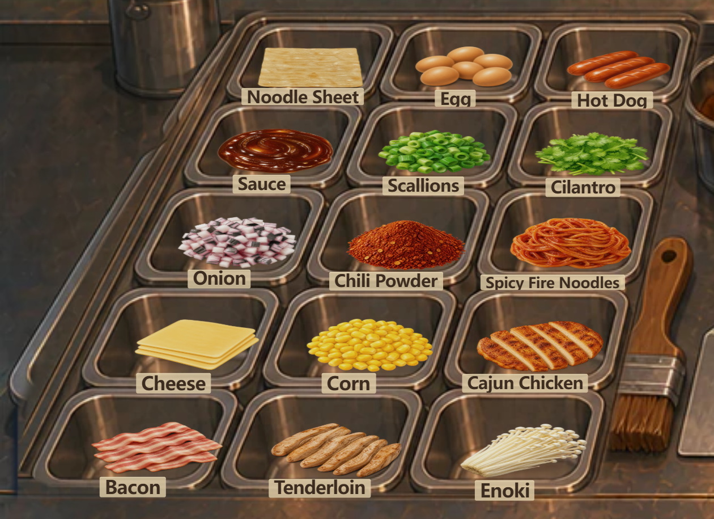

# Ingredient tray visual QA

Ingredient tray pasted/floating look: RESOLVED

## Cause and correction

The counter foreground re-painted the generic four-well rack over the existing six/fifteen-well plates. Food was positioned using a different number of wells, and the old visual polygons sat over back walls rather than floors. Labels overlapped the food; hover translated it upward.

The tray now renders the existing matching plate above the counter, masked to the left rack contour. No image asset or background file was changed. Each of the six base and fifteen expanded slots has its own usable rect, visual center, floor anchor, food width/height, offset, z-order, label anchor, maximum width and font size. Ingredient hit areas follow these wells, including sufficient logical-coordinate clearance around the front-rim labels. Pointer, cooking and campaign handlers are unchanged.

All fifteen images use independently measured alpha bounds and alpha-weighted centroids (alpha > 16) from their runtime WebP files. Transparent padding is corrected mathematically at render time; shared food images remain byte-for-byte unchanged. A warm-brown footprint shadow and subpixel contact shadow meet the food edge, with a subtle inset at the lower floor. Hover changes only the lighting. Labels use quiet, small cream rim strips, retain the existing English strings, and do not overlap food.

## Independent Day 6 placement

Widths/heights and offsets are logical pixels, never viewport-specific. Alpha correction below is relative to centering the original transparent image box; manual offsets are additional. Every ingredient has an independent alpha correction, and all fifteen expanded slots (plus all six base slots) have explicit scales.

| Slot | Ingredient | Food footprint | Manual offset x,y | Alpha center correction x,y | Alpha bounds x,y,w,h |
| --- | --- | --- | --- | --- | --- |
| 1 | Noodle Sheet | 62 × 23 | -1, 0 | -0.37, 0.02 | 14, 86, 486, 332 |
| 2 | Egg | 57 × 24 | 0, 0 | -0.96, -0.64 | 52, 96, 408, 319 |
| 3 | Hot Dog | 61 × 23 | -1, 0 | -1.67, -0.36 | 57, 97, 418, 334 |
| 4 | Sauce | 68 × 26 | 0, 0 | -0.33, -0.38 | 38, 103, 436, 313 |
| 5 | Scallions | 66 × 26 | 0, 0 | -0.15, -0.23 | 62, 105, 388, 295 |
| 6 | Cilantro | 68 × 26 | 0, 0 | -0.53, -0.47 | 29, 77, 452, 356 |
| 7 | Onion | 70 × 30 | -1, 0 | -0.85, -0.15 | 36, 77, 443, 359 |
| 8 | Chili Powder | 71 × 29 | 0, 1 | -0.38, -0.99 | 51, 112, 415, 290 |
| 9 | Spicy Fire Noodles | 72 × 30 | 0, 0 | -0.92, -0.61 | 57, 108, 407, 296 |
| 10 | Cheese | 73 × 30 | -1, 0 | -1.84, 0.70 | 39, 88, 451, 338 |
| 11 | Corn | 74 × 31 | 0, 0 | -0.18, -0.29 | 82, 127, 348, 257 |
| 12 | Cajun Chicken | 75 × 30 | -1, 0 | -0.75, -0.69 | 15, 114, 479, 296 |
| 13 | Bacon | 78 × 31 | 0, 0 | -0.45, -2.47 | 16, 101, 490, 349 |
| 14 | Tenderloin | 77 × 32 | -1, 0 | -0.97, -0.48 | 21, 90, 471, 336 |
| 15 | Enoki | 75 × 32 | -1, 0 | -0.80, 0.61 | 86, 91, 345, 317 |

Day 1 additionally uses manual offsets for Noodle Sheet (-2,0), Egg (0,1), Sauce (-1,1) and Scallions (-1,1). Its Noodle Sheet, Egg, Hot Dog, Sauce and Scallions footprints are respectively 110×35, 100×35, 113×38, 112×38 and 112×37. The spare sixth well has an explicit 114×42 profile.

## Real browser captures and review

- Build: npm run build:poki, English enforced by the production build.
- Browser: headless Microsoft Edge, mobile/touch contexts for narrow sizes.
- Poki SDK: mocked at its network boundary for deterministic local production QA; these are real gameplay browser screenshots, not a live Poki-hosted session.
- Four viewport sizes on Day 1 and Day 6; all eight full screenshots visually opened and reviewed. Two closeups rendered at DPR 3 (1260×915), also visually reviewed.
- Reviewed food-to-rim clearance, visual floor contact, perspective progression, label integration, and outer rack joins. Food is recognizable and seated in individual wells at all four sizes; Day 6 has fifteen visible wells.
- Browser errors: 0. Clipped labels: 0. Incorrect label click targets: 0. Hover displacement: 0. Maximum measured cross-viewport logical-coordinate drift: 0.0001 px.
- Tests: 89 geometry/component/style/interaction checks passed after final layout changes; 2 food/bin asset contract checks passed. Alpha bounds remain inside the visible masks on every campaign day, and labels are separated from painted food bounds.

| Size | Day 6 | Day 1 |
| --- | --- | --- |
| 640×360 | [Screenshot](ingredient-tray-640x360.png) | [Screenshot](ingredient-tray-day1-640x360.png) |
| 836×470 | [Screenshot](ingredient-tray-836x470.png) | [Screenshot](ingredient-tray-day1-836x470.png) |
| 844×390 | [Screenshot](ingredient-tray-844x390.png) | [Screenshot](ingredient-tray-day1-844x390.png) |
| 1440×810 | [Screenshot](ingredient-tray-1440x810.png) | [Screenshot](ingredient-tray-day1-1440x810.png) |

[Day 1 closeup](ingredient-tray-day1-closeup.png) · [Browser diagnostics](qa-results.json)

## Frozen scope

Character assets modified: NO

Gameplay logic modified: NO

HUD layout modified: NO

Griddle logic modified: NO

Campaign/progression modified: NO

Save schema modified: NO

Background image files, customer positions, griddle geometry, recipes, economy, Poki lifecycle, ads, Summary, Settings, Day Select and English copy: unchanged.

Delivery: one dedicated commit on codex/poki-platform-build-v1, pushed without merging main.
